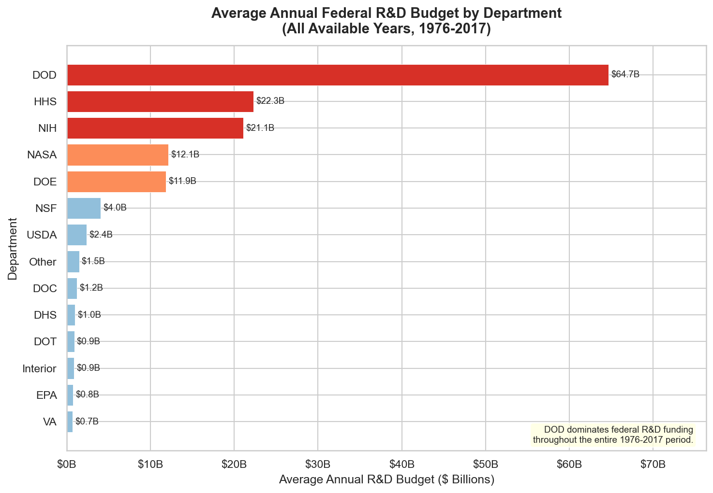

# Federal R&D Budget: Tidy Data Project

**Course:** SP26-MDSC-20009-01 | **Assignment:** Portfolio Update 2

---

## Overview

For this project, I worked with U.S. Federal R&D budget data from 1976 to 2017 and practiced applying tidy data principles to reshape it into something actually usable for analysis. The raw dataset was a mess — column headers had year and GDP info crammed together, and each row spanned decades instead of representing a single observation. I used `pd.melt()`, `str.split()`, and `str.replace()` to clean it up.

The end goal was to get the data into tidy format (one variable per column, one observation per row), then explore trends in how the federal government has allocated R&D funding across agencies over time.

---

## What is Tidy Data?

Hadley Wickham's tidy data framework (2014) defines a clean dataset as one where:
1. Each **variable** has its own column
2. Each **observation** has its own row
3. Each **type of observational unit** forms its own table

The raw file violated all three of these — so most of the work in this notebook was just getting the data into shape before doing any real analysis.

---

## Dataset

- **Source:** Federal R&D Budgets from [TidyTuesday (2019-02-12)](https://github.com/rfordatascience/tidytuesday/tree/main/data/2019/2019-02-12)
- **File:** `data/fed_rd_year&gdp.csv`
- **Raw shape:** 14 rows × 43 columns (one row per department, one column per year+GDP combo)
- **Tidy shape:** 562 rows × 4 columns: `department`, `year`, `rd_budget`, `gdp`
- **Agencies covered:** 14, including DOD, HHS, NIH, NASA, NSF, and DOE
- **Note:** Column headers like `1976_gdp1790000000000.0` had to be split to extract the year and GDP separately. Rows with missing budget data (e.g., DHS before 2002) were dropped.

---

## How to Run

### Dependencies

Install required packages:

```bash
pip install pandas matplotlib seaborn
```

| Library | Version | What it's used for |
|---|---|---|
| `pandas` | >= 1.3 | Data loading, reshaping, aggregation |
| `matplotlib` | >= 3.4 | Charts |
| `seaborn` | >= 0.11 | Styling |

### Steps

1. Clone the repo:
```bash
git clone https://github.com/vnandiva/Nandivada-Data-Science-Portfolio.git
cd Nandivada-Data-Science-Portfolio/TidyData-Project
```

2. Open the notebook:
```bash
jupyter notebook main.ipynb
```
Or open directly in [Google Colab](https://colab.research.google.com/) and run all cells.

---

## What I Did in the Notebook

1. Loaded the raw CSV and looked at the structure
2. Used `melt()` to convert from wide to long format
3. Split the combined column headers using `str.split()` to get separate `year` and `gdp` columns
4. Cleaned up trailing characters with `str.replace()`
5. Verified the tidy structure matched Wickham's three rules
6. Ran some aggregations — grouped by decade and built a pivot table
7. Made two visualizations on the cleaned data

---

## Visualizations

### R&D Spending by Department Over Time
Line chart showing how the top 6 departments' budgets changed from 1976–2017. The DOD spike during the Cold War era is pretty obvious, and you can see HHS/NIH grow significantly after 2000.

### Average Annual R&D Budget by Department


Horizontal bar chart comparing average annual budgets across all 14 agencies. DOD is way out in front at ~$64.7B/year on average.

---

## Key Takeaways

- DOD dominates federal R&D spending by a wide margin
- HHS and NIH saw the biggest growth in the 2000s
- NASA peaked in the late 70s/80s and has been declining since
- The 2000s were the highest-spending decade overall (~$1.86 trillion total)

---

## References

- Wickham, H. (2014). Tidy Data. *Journal of Statistical Software*, 59(10). https://vita.had.co.nz/papers/tidy-data.pdf
- Pandas Cheat Sheet: https://pandas.pydata.org/Pandas_Cheat_Sheet.pdf
- Dataset: https://github.com/rfordatascience/tidytuesday/tree/main/data/2019/2019-02-12
